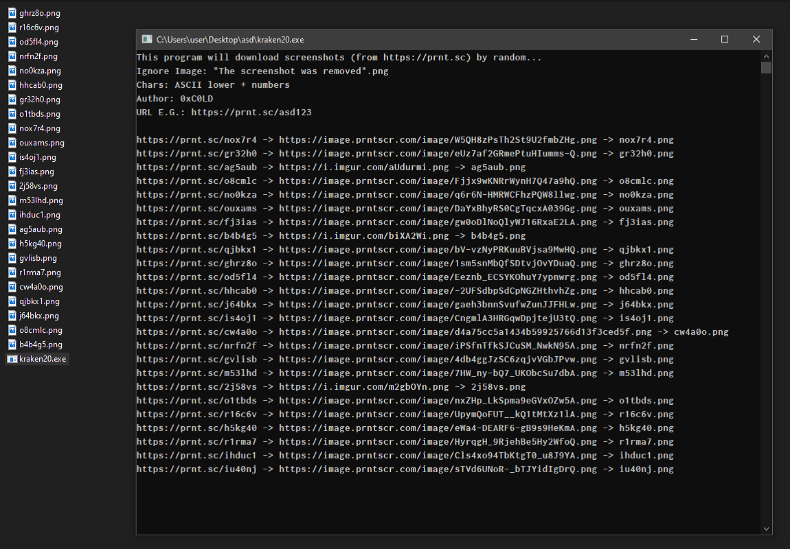

# kraken20
download random screenshots from prnt.sc (C#, console)
- download screenshots (from https://prnt.sc) by random...
- prnt.sc's urls contain 6 characters (ASCII lowercase & numbers, e.g. https://prnt.sc/qwe123)
- if the downloaded image is the "The screenshot was removed" image it will be disposed

